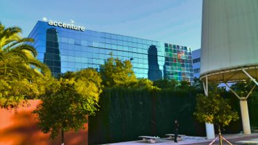

[Volver al índice general](../README.md)

# UD1 – Análisis del entorno y detección de necesidades tecnológicas

## Índice de apartados

- [ ] [**1. Análisis del sector tecnológico**](p1.md)
> En esta parte, usare como estandar del sector en Sevilla la informacion del techpark de sevilla (en la cartuja).

## Situacion actual del sector tecnologico en sevilla

El sector tecnológico en Sevilla se ha consolidado como un pilar económico fundamental, evidenciado por los resultados del TechPark en 2024, que cerró con una facturación récord de 4.850 millones de euros (un 8% más que el año anterior). Aunque el ritmo de crecimiento muestra una ligera estabilización frente a ejercicios previos, el mercado demuestra una madurez robusta que se traduce directamente en empleo: el parque cuenta ya con 31.667 trabajadores (+7,2%) y 144 empresas de alta innovación, garantizando un entorno de trabajo cualificado y en constante expansión.

Específicamente en el ámbito TIC, vital para el perfil ASIR, operan 94 empresas especializadas que facturan 995 millones de euros y emplean a 11.967 profesionales. Este denso tejido empresarial, compuesto por casi 600 compañías y 251 startups, genera necesidades críticas urgentes que justifican este proyecto: administración de infraestructuras para soportar la carga de trabajo, ciberseguridad avanzada para proteger los activos corporativos y soluciones de virtualización y Cloud para permitir despliegues ágiles y flexibles.
- [ ] [**2. Selección de la empresa o contexto de trabajo**](p2.md)
> En esta parte eligire la empresa sobre la que hablare el resto del trabajo, describiendola.

#### Empresa seleccionada = Acceture

**Accenture** es una compañía multinacional líder en servicios profesionales que ofrece soluciones en estrategia, consultoría, digital, tecnología y operaciones. A nivel global, la empresa es un gigante del sector que opera en más de 120 países y cuenta con una plantilla de aproximadamente **779.000 empleados**, cerrando su último ejercicio fiscal con una facturación mundial de 69.670 millones de dólares. Su modelo de negocio se basa en la innovación tecnológica para ayudar a clientes de todas las industrias a mejorar su rendimiento y crear valor sostenible.

En el contexto nacional y local, Accenture tiene una presencia muy relevante. En España emplea a más de **18.000 profesionales**, siendo uno de los principales empleadores del sector tecnológico. Específicamente en **Andalucía**, la compañía ha consolidado dos grandes centros tecnológicos en Málaga y Sevilla, que suman conjuntamente más de 3.500 trabajadores. La sede de **Sevilla**, ubicada en el entorno de Cartuja (Sevilla TechPark), cuenta con alrededor de **1.600 empleados** especializados, funcionando como un *hub* crítico para el desarrollo de proyectos internacionales y soporte a infraestructuras complejas.

La elección de esta empresa como objeto de estudio para este proyecto no es casual. He seleccionado Accenture principalmente porque **realicé mis prácticas de formación (FCT) en sus oficinas de Sevilla el curso pasado**. Esta experiencia previa me permite contar con un conocimiento directo y realista sobre su organización interna, sus flujos de trabajo y las necesidades tecnológicas de sus departamentos, lo que aportará un valor añadido de veracidad y viabilidad a la propuesta técnica que desarrollaré a continuación.

      
- [ ] [**3. Identificación de necesidades tecnológicas**](p3.md)

- [ ] [**4. Oportunidades y viabilidad del proyecto**](p4.md)

- [ ] [**5. Obligaciones legales y normativas**](p5.md)

- [ ] [**6. Guion inicial del proyecto**](p6.md)

## Enlaces a recursos de la unidad

- [Documentos de la unidad](./documentos/)
- [Diagramas e imágenes](./img/)

  ## Bibliografía / Webgrafía 
- Autor1, Título del libro o artículo, Editorial/Año.
- Sitio web oficial: [Enlace](https://www.ejemplo.com)
- Tutoriales y guías recomendadas: [Enlace](https://www.ejemplo2.com)

